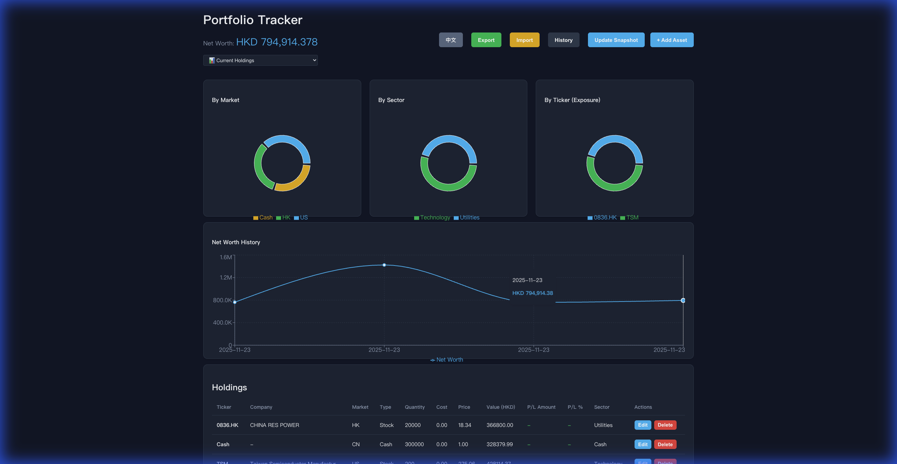
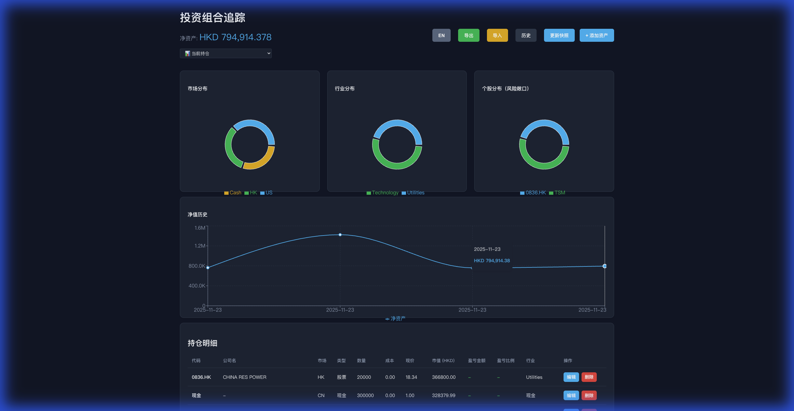
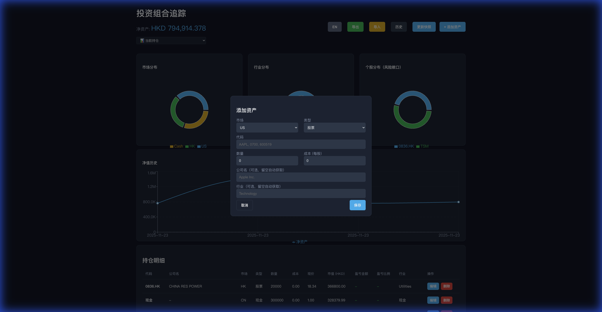
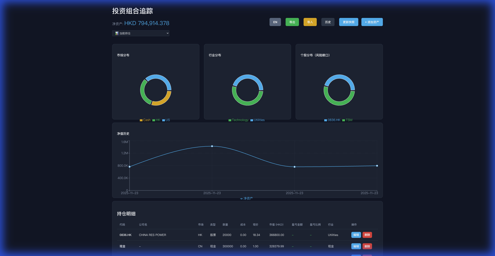

# Portfolio Management Dashboard

A personal investment portfolio tracking application designed to manage and visualize your assets across multiple markets (US, HK, CN). Built with React (Frontend) and FastAPI (Backend).

## 📸 Features Overview

### 1. Comprehensive Dashboard
Visualize your Net Worth, Market Distribution, and Sector Allocation in one view.


### 2. Internationalization (i18n)
One-click toggle between English and Chinese (中文).


### 3. Smart Asset Management
Support for **Stocks, Options (Put/Call), and Cash**. Auto-fetches company names, sectors, and real-time prices.


### 4. Historical Analysis & Time Travel
Track Net Worth history with precise tooltips. Use the **Snapshot Selector** to travel back and view your portfolio state at any past date.


---

## 🚀 Installation & Setup

### Prerequisites
- **Python 3.8+**
- **Node.js 16+**

### 1. Backend Setup (Python/FastAPI)

```bash
# Navigate to project root
cd protofolio_mangament

# Create virtual environment
python3 -m venv venv

# Activate virtual environment
source venv/bin/activate  # macOS/Linux
# venv\Scripts\activate   # Windows

# Install dependencies
pip install -r requirements.txt

# Run the backend server
uvicorn backend.main:app --reload --port 8000
```

### 2. Frontend Setup (React/Vite)

```bash
# Navigate to frontend directory
cd frontend

# Install dependencies
npm install

# Run the development server
npm run dev -- --port 3000
```

Access the application at: `http://localhost:3000`

---

## 📖 User Guide

### Adding Assets
1. Click **"Add Asset"** (添加资产).
2. Select **Market** (US/HK/CN) and **Type** (Stock/Option/Cash).
3. Enter **Ticker** (e.g., `AAPL`, `0700`, `600519`).
4. Enter **Quantity** and **Cost Basis**.
   - *Note*: For "Sell Put" options, select "Short" side; the system handles negative quantity logic.
5. (Optional) Leave **Company Name** and **Sector** blank to auto-fetch them.

### Updating Snapshots
- Click **"Update Snapshot"** (更新快照) whenever you want to save your current portfolio state.
- This creates a data point in the "Net Worth History" chart.

### Viewing History
1. Use the dropdown menu at the top left (default: "📊 Current Holdings").
2. Select a past date to view the portfolio state (Holdings & Charts) at that time.
3. Historical views are **Read-Only**.

### Data Backup
- **Export**: Click "Export" to download `portfolio_data.json`.
- **Import**: Click "Import" to restore data from a JSON file.

---

## 🛠 Tech Stack

- **Frontend**: React, Vite, Recharts (Visualization), CSS Modules.
- **Backend**: FastAPI, Pydantic, yfinance (Market Data).
- **Data Storage**: Local JSON file (`portfolio_data.json`) for simplicity and portability.
